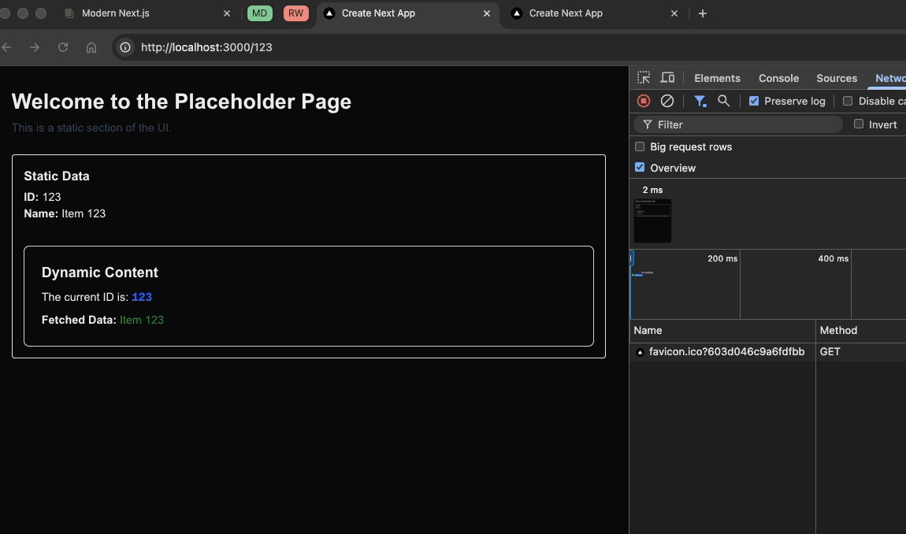
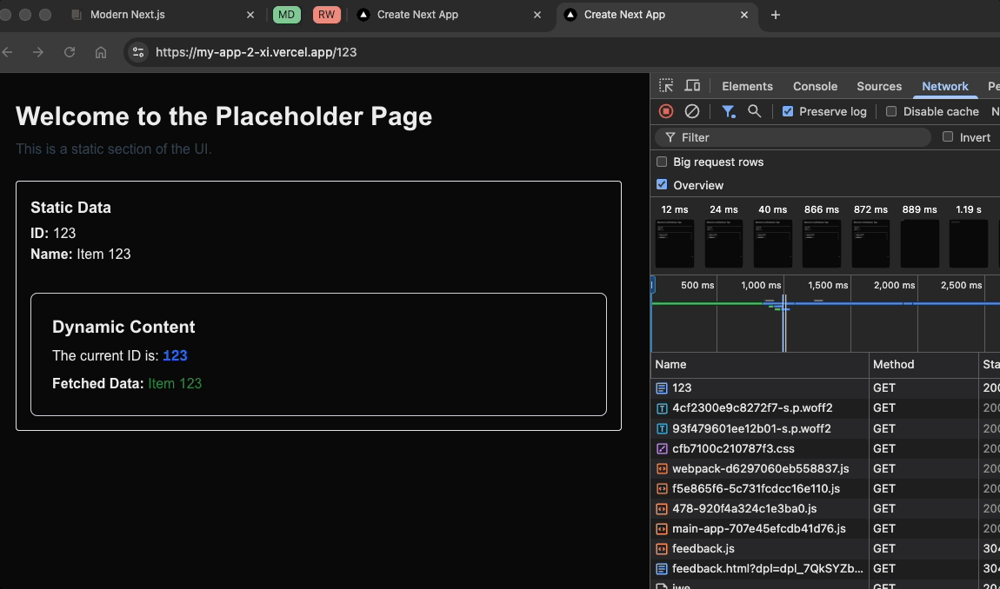
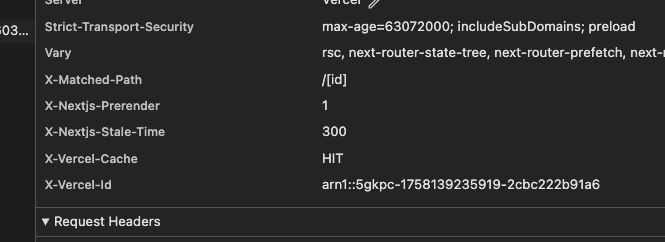

# Next.js Cache Behavior Demonstration

This project demonstrates a difference in caching behavior between local development and deployed environments when using `"use cache"` directive with `cacheLife("max")`.

## Project Structure

The application has:

- **Static Data Component**: Uses `"use cache"` with `cacheLife("max")` - should be cached and not refetch
- **Dynamic Data Component**: Regular data fetching - should refetch on each request

## Expected Behavior (Production Build)

When running a production build locally (`npm run build` then `npm run start`), the static data is properly cached and does **not** rerun when you refresh the page:

## Actual Behavior (Vercel Deployment)

When deployed to Vercel at [https://my-app-2-xi.vercel.app/123](https://my-app-2-xi.vercel.app/123), the static data **incorrectly reruns** and refetches on every page refresh:

### Network Headers Show Cache Hit

Interestingly, the network tab shows cache-related headers indicating the content should be cached:

Despite these headers suggesting caching is working, the static data still refetches on every refresh.